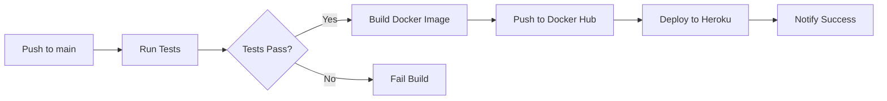

# CI/CD Configuration Guide

This document explains the CI/CD setup for the Digital Wellbeing System.

## Overview

The project uses **GitHub Actions** for continuous integration and deployment. We have 5 workflow files:

1. **backend-ci.yml** - Backend testing, Docker builds, and deployment
2. **mobile-ci.yml** - Mobile app testing and builds
3. **ai-models-ci.yml** - ML model training and validation
4. **docker-compose-ci.yml** - Docker infrastructure testing
5. **code-quality.yml** - Code quality checks and security scanning

---

## Workflows

### 1. Backend CI/CD (`backend-ci.yml`)

**Triggers:**
- Push to `main` or `develop` branches
- Pull requests to `main` or `develop`
- Changes in `backend-api/**` directory

**Jobs:**
- **Test**: Run pytest suite
- **Docker**: Build and push Docker image to Docker Hub
- **Deploy**: Automated deployment to Heroku

**Required Secrets:**
- `DOCKER_USERNAME` - Docker Hub username
- `DOCKER_PASSWORD` - Docker Hub password
- `HEROKU_API_KEY` - Heroku API key
- `HEROKU_APP_NAME` - Heroku app name
- `HEROKU_EMAIL` - Heroku account email

---

### 2. Mobile App CI (`mobile-ci.yml`)

**Triggers:**
- Push to `main` or `develop` branches
- Pull requests
- Changes in `mobile-app/**` directory

**Jobs:**
- **Test**: Run linting and tests
- **Build**: Expo export and Android APK build

**Required Secrets:**
- `EXPO_TOKEN` - Expo access token (for EAS builds)

---

### 3. AI/ML Models CI (`ai-models-ci.yml`)

**Triggers:**
- Push to `main` or `develop` branches
- Changes in `ai-models/**` directory

**Jobs:**
- **Test**: Train notification classifier
- **Validate**: Verify model performance

**Artifacts:**
- ML models stored for 30 days
- Can be downloaded from GitHub Actions artifacts

---

### 4. Docker Compose CI (`docker-compose-ci.yml`)

**Triggers:**
- Push to `main` branch
- Changes in Docker configuration files

**Jobs:**
- **Test**: Build and start Docker Compose services
- **Security**: Trivy vulnerability scanning

---

### 5. Code Quality (`code-quality.yml`)

**Triggers:**
- Push to `main` or `develop` branches
- Pull requests

**Jobs:**
- **Python Quality**: flake8, black, pylint, bandit, safety
- **JavaScript Quality**: ESLint, Prettier
- **Dependency Review**: Check for vulnerable dependencies

---

## Setting Up GitHub Secrets

### Step 1: Docker Hub Secrets

1. Create Docker Hub account at https://hub.docker.com
2. Go to GitHub repo → Settings → Secrets and variables → Actions
3. Add secrets:
   - `DOCKER_USERNAME`: Your Docker Hub username
   - `DOCKER_PASSWORD`: Docker Hub password or access token

### Step 2: Heroku Secrets (Optional)

1. Create Heroku account at https://heroku.com
2. Get API key: Account Settings → API Key
3. Create app: `heroku create your-app-name`
4. Add GitHub secrets:
   - `HEROKU_API_KEY`: Your Heroku API key
   - `HEROKU_APP_NAME`: Your Heroku app name
   - `HEROKU_EMAIL`: Your Heroku account email

### Step 3: Expo Token (Optional)

1. Create Expo account at https://expo.dev
2. Generate token: `npx eas-cli login && npx eas-cli token:create`
3. Add GitHub secret:
   - `EXPO_TOKEN`: Your Expo access token

---

## Workflow Behavior

### On Pull Request
- ✅ Run all tests
- ✅ Check code quality
- ✅ Security scanning
- ❌ **NO** deployment (safe for review)

### On Push to `main`
- ✅ Run all tests
- ✅ Build Docker images
- ✅ Push to Docker Hub
- ✅ Deploy to Heroku (if configured)
- ✅ Security scanning

### On Push to `develop`
- ✅ Run all tests
- ✅ Check code quality
- ❌ **NO** deployment (development branch)

---

## Local Testing

Test workflows locally with [act](https://github.com/nektos/act):

```bash
# Install act
brew install act  # macOS
# or
curl https://raw.githubusercontent.com/nektos/act/master/install.sh | sudo bash

# Run workflow locally
act -j test

# Run specific workflow
act -W .github/workflows/backend-ci.yml
```

---

## Continuous Deployment Flow



---

## Monitoring CI/CD

**GitHub Actions Dashboard:**
- Go to repository → Actions tab
- View workflow runs, logs, and artifacts

**Status Badges:**
Add to README.md:
```markdown

```

---

## Troubleshooting

### Docker Build Fails
- Check Dockerfile syntax
- Verify all dependencies in requirements.txt
- Review Docker build logs in Actions

### Heroku Deployment Fails
- Verify Procfile exists
- Check runtime.txt has correct Python version
- Ensure all secrets are set correctly

### Tests Fail
- Run tests locally first: `pytest tests/ -v`
- Check for environment-specific issues
- Review test logs in GitHub Actions

### Security Scan Issues
- Review Trivy scan results
- Update vulnerable dependencies
- Check Docker image base version

---

## Best Practices

1. **Always run tests locally before pushing**
2. **Use pull requests for code review**
3. **Don't commit secrets to code**
4. **Keep dependencies updated**
5. **Monitor workflow runs regularly**
6. **Use semantic versioning for releases**
7. **Add status checks to protect main branch**

---

## Next Steps

- [ ] Set up GitHub branch protection rules
- [ ] Configure automated releases
- [ ] Add performance testing
- [ ] Set up monitoring and alerts
- [ ] Implement blue-green deployment
- [ ] Add canary releases

---

**Last Updated**: Day 7 - December 6, 2024
